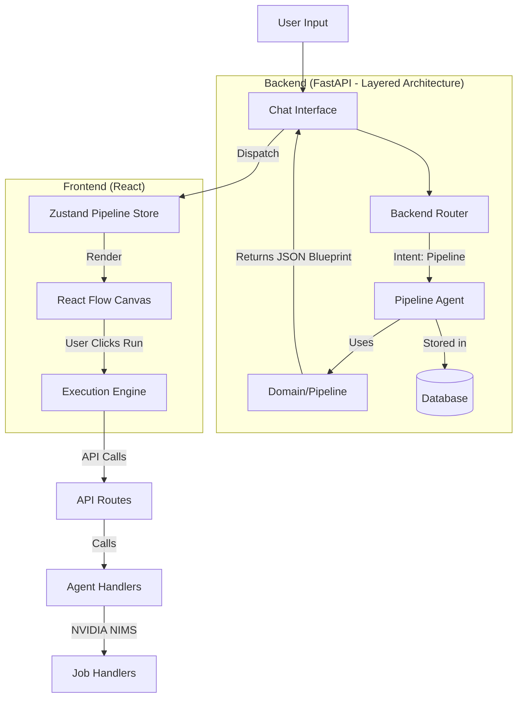

# Technical PRD: Pipeline Agent & Visual Canvas Integration

**Project:** NovoProtein AI  
**Version:** 2.0  
**Status:** Active Development  
**Target:** Hybrid Chat + Visual DAG Workflow  
**Last Updated:** January 2025

## 1. Executive Summary

The goal is to transition NovoProtein AI from a purely linear chat interface to a **Hybrid Chat-DAG (Directed Acyclic Graph) System**. A new backend "Pipeline Agent" will act as an *architect*, analyzing user requests to generate visual workflow blueprints (Graph JSON) without executing them. The frontend will render these as interactive "Ghost Nodes" on a canvas, allowing users to review, configure, and execute scientific pipelines (RFdiffusion → ProteinMPNN → AlphaFold) with "Human-in-the-Loop" safety.

## 2. Problem Statement

  * **Context Loss:** Complex bio-engineering requires multiple dependent steps (Backbone → Sequence → Folding). Chat history buries these relationships.
  * **Opaque Execution:** Users cannot easily see parameters or status of intermediate steps in a long chat thread.
  * **Reproducibility:** Chat logs are hard to rerun. A visual graph provides a saved state that can be re-executed or branched.

## 3. User Stories

| ID | As a... | I want to... | So that... |
| :--- | :--- | :--- | :--- |
| **US-1** | Protein Engineer | Ask "Design a binder for `target.pdb`" | The system automatically sets up the correct 3-stage pipeline (RF→MPNN→AF) on the canvas. |
| **US-2** | User | See the proposed pipeline *before* it runs | I can tweak parameters (e.g., change contig length) to avoid wasting GPU credits. |
| **US-3** | Researcher | Have the system prompt me for missing files | I don't get obscure error messages later in the process. |
| **US-4** | User | Click "Run All" on the canvas | The system executes the nodes in dependency order, updating status visuals in real-time. |
| **US-5** | User | Save and load pipelines | I can reuse successful workflows without recreating them. |
| **US-6** | User | View execution logs for each node | I can debug failures and understand what happened during execution. |

-----

## 4. Technical Architecture

### 4.1 System Diagram



### 4.2 Backend Architecture (Layered Structure)

The backend has been refactored into a clean, scalable layered architecture:

```
server/
├── app.py                    # FastAPI application entry point
│
├── api/                      # API Layer
│   ├── routes/              # API route handlers
│   │   ├── pipelines.py     # Pipeline persistence endpoints
│   │   ├── chat_sessions.py # Chat session management
│   │   └── ...
│   └── middleware/          # API middleware
│       ├── auth.py          # Authentication
│       ├── cors.py          # CORS handling
│       └── ...
│
├── agents/                   # LLM Agents
│   ├── registry.py          # Agent registry and definitions
│   ├── router.py            # Request routing logic
│   ├── runner.py            # Agent execution engine
│   ├── handlers/            # Agent-specific handlers
│   │   ├── alphafold.py
│   │   ├── rfdiffusion.py
│   │   ├── proteinmpnn.py
│   │   └── pipeline.py      # Pipeline agent handler
│   └── prompts/             # System prompts (separated by agent)
│       ├── pipeline.py      # Pipeline architect prompts
│       ├── alphafold.py
│       └── ...
│
├── domain/                   # Domain Logic
│   ├── pipeline/            # Pipeline domain
│   │   ├── schema.py        # Pipeline data models
│   │   ├── context.py       # Pipeline context management
│   │   └── blueprint.py     # Blueprint generation logic
│   ├── protein/             # Protein domain
│   │   ├── sequence.py      # Sequence utilities
│   │   └── uniprot.py       # UniProt integration
│   └── storage/             # Storage domain
│       ├── pdb_storage.py   # PDB file storage
│       └── session_tracker.py # Session file tracking
│
├── tools/                    # External Tools & Clients
│   └── nvidia/              # NVIDIA NIMS API tools
│       ├── client.py        # Base NIMS client
│       ├── rfdiffusion.py   # RFdiffusion client
│       ├── proteinmpnn.py   # ProteinMPNN client
│       └── alphafold.py     # AlphaFold client
│
├── memory/                   # Memory & RAG
│   └── rag/                 # Retrieval-Augmented Generation
│       └── mvs_rag.py       # Molecular visualization RAG
│
└── infrastructure/           # Infrastructure & Utilities
    ├── utils.py             # General utilities
    ├── auth.py              # Authentication utilities
    ├── config.py            # Configuration management
    └── safety.py            # Safety checks
```

### 4.3 Data Models

#### Backend Schema (`server/domain/pipeline/schema.py`)

This defines the contract between the Agent and the Frontend.

```python
from pydantic import BaseModel
from typing import List, Dict, Any, Literal, Optional

# Node types (must match frontend NodeType)
NodeType = Literal[
    "input_node",
    "rfdiffusion_node",
    "proteinmpnn_node",
    "alphafold_node",
    "message_input_node",
    "http_request_node"
]

class PipelineNodeBlueprint(BaseModel):
    id: str
    type: NodeType
    label: str
    config: Dict[str, Any]  # Initial params (e.g., {"contigs": "50"})
    inputs: Dict[str, str]  # Data contracts (e.g., {"target": "previous_node_id"})

class PipelineBlueprint(BaseModel):
    rationale: str          # Message to user: "I've drafted a binder design..."
    nodes: List[PipelineNodeBlueprint]
    edges: List[Dict[str, str]] # [{"source": "A", "target": "B"}]
    missing_resources: List[str] # ["target_pdb"] - if input is missing
```

#### Database Schema (`server/database/`)

Pipeline persistence is handled through the database layer:

- **Pipelines Table**: Stores pipeline definitions with JSON serialization
- **Message-Scoped Pipelines**: Pipelines can be associated with specific chat messages
- **User Isolation**: All pipelines are scoped to the authenticated user

The database structure supports:
- Pipeline CRUD operations
- Message and conversation associations
- User-scoped access control
- Status tracking (draft, running, completed, error)

-----

## 5. Functional Requirements

### 5.1 The Pipeline Agent (`server/agents/prompts/pipeline.py` + `server/agents/handlers/pipeline.py`)

  * **Role:** Strictly a planner. **NEVER** executes code or calls the GPU APIs.
  * **Location:** 
    - Prompts: `server/agents/prompts/pipeline.py`
    - Handler: `server/agents/handlers/pipeline.py` (if needed)
  * **Trigger:** Activated when Router (`server/agents/router.py`) detects intents like "create pipeline", "design workflow", "fold this", or "binder for...".
  * **Logic:**
    1.  **Context Check:** Look at recent chat history for uploaded PDB files using `server/domain/pipeline/context.py`.
    2.  **Validation:** If user asks for "binder design" but no PDB is present, return `missing_resources: ["target_pdb"]` and a text prompt.
    3.  **Drafting:** If valid, construct the JSON Blueprint using `server/domain/pipeline/blueprint.py` connecting the standard toolchain.
  * **Safety:** Must adhere to data types (e.g., ProteinMPNN *must* follow RFdiffusion or an uploaded backbone). Validation handled by `server/domain/pipeline/schema.py`.

### 5.2 Frontend Canvas (`src/components/pipeline-canvas/`)

  * **Library:** React Flow (Pro or standard).
  * **Location:** `src/components/pipeline-canvas/components/PipelineCanvas.tsx`
  * **Ghost State:** When a blueprint arrives, nodes render with `opacity-50` and a dashed border.
  * **User Action:**
      * **"Approve":** Turns nodes solid, saves them to `pipelineStore`.
      * **"Reject":** Clears the ghost nodes.
  * **Orchestration Logic:**
      * The frontend uses `utils/executionEngine.ts` to iterate through the topological sort of the graph.
      * Step 1: Check Input Node (File exists?).
      * Step 2: Trigger RFdiffusion API. Poll until status = `success`.
      * Step 3: Pass Output PDB path from Step 2 to Step 4 (ProteinMPNN).

### 5.3 UI Components

The pipeline canvas library includes the following components:

  * **Core Components:**
      * `PipelineCanvas.tsx`: Main React Flow canvas
      * `PipelineNodeConfig.tsx`: Node configuration panel
      * `PipelineNodePalette.tsx`: Node palette sidebar for adding nodes
      * `PipelineExecution.tsx`: Execution orchestrator with status tracking
      * `PipelineManager.tsx`: Pipeline management modal (save/load)
      * `CustomHandle.tsx`: n8n-style connection handles with plus icons
      * `ExecutionLogsPanel.tsx`: Execution logs viewer for debugging
      * `SavedPipelinesList.tsx`: List of saved pipelines
      * `SavePipelineDialog.tsx`: Dialog for saving pipelines

  * **Node Types:**
      * `InputNode`: Dropzone for PDB files
      * `RFdiffusionNode`: Displays "Contig" input field, design mode, and other parameters
      * `ProteinMPNNNode`: Displays "Num Sequences" slider and temperature
      * `AlphaFoldNode`: Displays "Recycle Count" input and relaxation steps
      * `MessageInputNode`: Input from chat messages
      * `HttpRequestNode`: HTTP API integration node

  * **Status Badges:** Small icons on nodes (Spinner, Checkmark, Red X) with execution status.

### 5.4 Execution Engine

The execution engine (`src/components/pipeline-canvas/utils/executionEngine.ts`) handles:

  * **Topological Sorting:** Determines execution order based on node dependencies
  * **Status Management:** Tracks node status (idle, running, success, error, completed)
  * **Data Flow:** Passes outputs from one node to inputs of dependent nodes
  * **Error Handling:** Catches and displays errors with context
  * **Template Resolution:** Uses `templateResolver.ts` to resolve variable references in node configs

-----

## 6. API Interface Contracts

### POST `/api/agent/pipeline`

**Endpoint Location:** `server/api/routes/` (via agent router)

**Request:**

```json
{
  "user_prompt": "Generate a binder for target.pdb with 50aa length",
  "chat_history": [...],
  "available_files": ["target.pdb"]
}
```

**Response (Success):**

```json
{
  "type": "blueprint",
  "rationale": "I have set up a motif scaffolding pipeline. Please review the contig settings.",
  "blueprint": {
    "nodes": [
      { "id": "n1", "type": "input_node", "config": { "filename": "target.pdb" } },
      { "id": "n2", "type": "rfdiffusion_node", "config": { "contigs": "A50-150" } },
      { "id": "n3", "type": "proteinmpnn_node", "config": { "num_sequences": 8 } }
    ],
    "edges": [
      { "source": "n1", "target": "n2" },
      { "source": "n2", "target": "n3" }
    ],
    "missing_resources": []
  }
}
```

**Response (Missing Info):**

```json
{
  "type": "text",
  "content": "To design a binder, I first need a target structure. Please upload a PDB file."
}
```

### POST `/api/pipelines`

**Endpoint Location:** `server/api/routes/pipelines.py`

Save or update a pipeline. Supports message-scoped pipelines.

**Request:**

```json
{
  "id": "pipeline-uuid",
  "name": "Binder Design Pipeline",
  "description": "Design binder for target protein",
  "nodes": [...],
  "edges": [...],
  "message_id": "optional-message-id",
  "conversation_id": "optional-conversation-id"
}
```

**Response:**

```json
{
  "id": "pipeline-uuid",
  "name": "Binder Design Pipeline",
  "status": "draft",
  "created_at": "2025-01-01T00:00:00Z",
  "updated_at": "2025-01-01T00:00:00Z"
}
```

### GET `/api/pipelines`

**Endpoint Location:** `server/api/routes/pipelines.py`

List all pipelines for the current user, optionally filtered by message or conversation.

**Query Parameters:**
- `message_id`: Filter by message ID
- `conversation_id`: Filter by conversation ID
- `status`: Filter by status (draft, running, completed, error)

### GET `/api/pipelines/{pipeline_id}`

**Endpoint Location:** `server/api/routes/pipelines.py`

Retrieve a specific pipeline by ID.

-----

## 7. Implementation Roadmap

### Phase 1: The "Ghost" (Visualization Only) ✅ COMPLETED

  * [x] Install `reactflow`.
  * [x] Create the `PipelineStore` in Zustand.
  * [x] Implement `PipelineAgent` in backend (Mocked response initially).
  * [x] Build the Canvas UI that renders JSON blueprints as read-only nodes.
  * [x] Extract pipeline canvas as standalone library (`src/components/pipeline-canvas/`)
  * [x] Add n8n-style input/output handles to nodes
  * [x] Create JSON configuration files for each node type

### Phase 1.5: Library Extraction ✅ COMPLETED

  * [x] Create `pipeline-canvas/` library structure with:
    - `package.json` for npm package configuration
    - `tsconfig.json` for TypeScript compilation
    - `index.ts` for main exports
    - `style.css` for library styles
  * [x] Move components to `components/` subfolder:
    - PipelineCanvas, PipelineNodeConfig, PipelineNodePalette
    - PipelineExecution, PipelineManager, CustomHandle
    - ExecutionLogsPanel, SavedPipelinesList, SavePipelineDialog
  * [x] Create JSON node definitions in `nodes/*/node.json`:
    - input_node, rfdiffusion_node, proteinmpnn_node, alphafold_node
    - message_input_node, http_request_node
    - Each includes: metadata, schema, handles, execution config, defaults
  * [x] Create utilities:
    - `topologicalSort.ts` for execution order
    - `nodeLoader.ts` for dynamic JSON configuration loading
    - `executionEngine.ts` for pipeline execution orchestration
    - `templateResolver.ts` for variable resolution in configs
  * [x] Update main project imports for backwards compatibility

### Phase 1.6: Backend Architecture Refactoring ✅ COMPLETED

  * [x] Refactor server from flat structure to layered architecture
  * [x] Move agents to `server/agents/` with handlers and prompts separation
  * [x] Create domain layer: `server/domain/pipeline/`, `server/domain/protein/`, `server/domain/storage/`
  * [x] Move tools to `server/tools/nvidia/` for external integrations
  * [x] Create API layer: `server/api/routes/` and `server/api/middleware/`
  * [x] Update all imports to use new structure
  * [x] Implement pipeline persistence API endpoints

### Phase 2: The "Architect" (Agent Logic)

  * [ ] Implement full Prompt Engineering for `PipelineAgent` in `server/agents/prompts/pipeline.py`.
  * [ ] Add logic to parse PDB file presence from chat history using `server/domain/pipeline/context.py`.
  * [ ] Connect Chat UI to trigger the Ghost view.
  * [ ] Implement blueprint generation logic in `server/domain/pipeline/blueprint.py`.

### Phase 3: The "Builder" (Execution)

  * [x] Implement "Run" button logic in frontend using `executionEngine.ts`.
  * [x] Update existing API handlers (`server/agents/handlers/alphafold.py`, etc.) to return consistent JSON status updates suitable for polling.
  * [ ] Add "View Result" button on nodes to load PDBs into the existing Molstar Viewer.
  * [x] Implement execution logs panel for debugging.
  * [x] Add pipeline save/load functionality.

---

## 8. Pipeline Canvas Library Structure

The pipeline canvas has been extracted as a standalone library for reusability:

```
src/components/pipeline-canvas/
├── package.json                    # npm package configuration
├── tsconfig.json                   # TypeScript config
├── vite.config.ts                  # Vite build config
├── style.css                       # Library styles
├── index.ts                        # Main exports
├── components/
│   ├── PipelineCanvas.tsx          # Main canvas (React Flow)
│   ├── PipelineNodeConfig.tsx     # Node configuration panel
│   ├── PipelineNodePalette.tsx    # Node palette sidebar
│   ├── PipelineExecution.tsx       # Execution orchestrator
│   ├── PipelineManager.tsx         # Pipeline management modal
│   ├── CustomHandle.tsx            # n8n-style connection handles
│   ├── ExecutionLogsPanel.tsx     # Execution logs viewer
│   ├── SavedPipelinesList.tsx      # Saved pipelines list
│   ├── SavePipelineDialog.tsx      # Save pipeline dialog
│   └── index.ts                    # Component exports
├── nodes/
│   ├── input_node/
│   │   └── node.json               # Input node configuration
│   ├── rfdiffusion_node/
│   │   └── node.json               # RFdiffusion configuration
│   ├── proteinmpnn_node/
│   │   └── node.json               # ProteinMPNN configuration
│   ├── alphafold_node/
│   │   └── node.json               # AlphaFold configuration
│   ├── message_input_node/
│   │   └── node.json               # Message input node
│   └── http_request_node/
│       └── node.json               # HTTP request node
├── types/
│   └── index.ts                    # TypeScript type definitions
├── store/
│   └── pipelineStore.ts            # Zustand pipeline store
└── utils/
    ├── index.ts                    # Utility exports
    ├── topologicalSort.ts          # Graph sorting for execution
    ├── nodeLoader.ts               # JSON config loader
    ├── executionEngine.ts          # Pipeline execution engine
    └── templateResolver.ts         # Variable resolution in configs
```

### Node JSON Configuration Schema

Each node type is defined in a JSON file with the following structure:

```json
{
  "metadata": {
    "type": "node_type",
    "label": "Display Name",
    "icon": "LucideIconName",
    "color": "#hexcolor",
    "description": "Node description"
  },
  "schema": {
    "field_name": {
      "type": "string|number|boolean|select|textarea|json",
      "required": false,
      "default": "value",
      "label": "Field Label",
      "placeholder": "Placeholder text",
      "helpText": "Help text",
      "min": 0,
      "max": 100,
      "step": 0.1,
      "options": [{"value": "opt1", "label": "Option 1"}]
    }
  },
  "handles": {
    "inputs": [
      {
        "id": "target",
        "type": "target",
        "position": "left",
        "dataType": "pdb_file"
      }
    ],
    "outputs": [
      {
        "id": "source",
        "type": "source",
        "position": "right",
        "dataType": "pdb_file"
      }
    ]
  },
  "execution": {
    "type": "api_call",
    "endpoint": "/api/endpoint",
    "method": "POST",
    "pollInterval": 2000
  },
  "defaultConfig": {
    "field_name": "default_value"
  }
}
```

### Library Usage

```typescript
// Import from the library
import { 
  PipelineCanvas, 
  PipelineManager,
  PipelineExecution,
  ExecutionLogsPanel,
  usePipelineStore,
  type PipelineNode,
  type Pipeline
} from './components/pipeline-canvas';

// Use in your React app
<PipelineCanvas />
<PipelineExecution apiClient={myApiClient} />
<ExecutionLogsPanel />
```

### Backend Domain Models

The backend uses matching schema definitions in `server/domain/pipeline/schema.py`:

- `NodeType`: Enum of all supported node types
- `NodeHandle`: Input/output handle definition with data types
- `NodeSchemaField`: Field schema with validation rules
- `NodeDefinition`: Complete node type definition
- `PipelineNodeBlueprint`: Node in a blueprint
- `PipelineBlueprint`: Complete pipeline blueprint
- `NODE_DEFINITIONS`: Dictionary of all node definitions
- `can_connect()`: Validates if two nodes can be connected
- `validate_blueprint()`: Validates a complete blueprint

---

## 9. Backend File System Reference

### Agent System

- **Agent Registry**: `server/agents/registry.py` - All agent definitions
- **Router**: `server/agents/router.py` - Request routing logic
- **Runner**: `server/agents/runner.py` - Agent execution engine
- **Pipeline Prompts**: `server/agents/prompts/pipeline.py` - Pipeline architect prompts
- **Pipeline Handler**: `server/agents/handlers/pipeline.py` (if needed)

### Domain Layer

- **Pipeline Schema**: `server/domain/pipeline/schema.py` - Data models and validation
- **Pipeline Context**: `server/domain/pipeline/context.py` - Context management (file tracking, chat history)
- **Pipeline Blueprint**: `server/domain/pipeline/blueprint.py` - Blueprint generation logic

### API Layer

- **Pipeline Routes**: `server/api/routes/pipelines.py` - Pipeline CRUD endpoints
- **Auth Middleware**: `server/api/middleware/auth.py` - Authentication
- **CORS Middleware**: `server/api/middleware/cors.py` - CORS handling

### Tools

- **NVIDIA Base Client**: `server/tools/nvidia/client.py` - Base NIMS API client
- **RFdiffusion Client**: `server/tools/nvidia/rfdiffusion.py` - RFdiffusion API
- **ProteinMPNN Client**: `server/tools/nvidia/proteinmpnn.py` - ProteinMPNN API
- **AlphaFold Client**: `server/tools/nvidia/alphafold.py` - AlphaFold API

### Storage

- **PDB Storage**: `server/domain/storage/pdb_storage.py` - PDB file storage
- **Session Tracker**: `server/domain/storage/session_tracker.py` - Session file tracking

---

## 10. Success Metrics

  * **Safety:** Zero crashes of the main app during pipeline generation.
  * **Accuracy:** Agent correctly identifies when a PDB file is missing 100% of the time.
  * **Usability:** Users can successfully run a 3-step pipeline (RF→MPNN→AF) with < 3 clicks after the chat request.
  * **Performance:** Pipeline execution completes without blocking the UI.
  * **Reliability:** Execution logs provide sufficient context for debugging failures.

---

## 11. Development Guidelines

### Adding New Node Types

1. **Frontend**: Create `src/components/pipeline-canvas/nodes/{node_type}/node.json` with full schema
2. **Backend**: Add node type to `NodeType` literal in `server/domain/pipeline/schema.py`
3. **Backend**: Add node definition to `NODE_DEFINITIONS` in `server/domain/pipeline/schema.py`
4. **Backend**: Create handler in `server/agents/handlers/{node_type}.py` if needed
5. **Backend**: Add execution endpoint in `server/api/routes/` if needed
6. **Documentation**: Update this PRD with the new node type

### Best Practices

- Always initialize nodes with default config (see `docs/node-development-guide.md`)
- Keep execution logs accessible after completion
- Don't force navigation during execution
- Handle multiple data structures in output extraction
- Use template resolution for dynamic config values

See `docs/node-development-guide.md` for detailed development guidelines.

---

## 12. Future Enhancements

- **Pipeline Templates**: Pre-built pipeline templates for common workflows
- **Pipeline Sharing**: Share pipelines between users
- **Pipeline Versioning**: Version control for pipelines
- **Advanced Error Recovery**: Automatic retry with parameter adjustments
- **Pipeline Analytics**: Track success rates and performance metrics
- **Custom Node Types**: User-defined node types via plugin system
